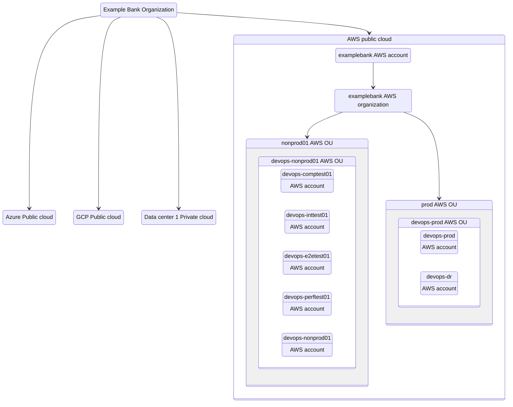

```mermaid
stateDiagram-v2
    classDef badBadEvent fill : #f00,color:white,font-weight:bold,stroke-width:2px,stroke:yellow
    example_bank_organization : Example Bank Organization
    aws_public_cloud : AWS public cloud
    example_bank_organization --> aws_public_cloud
    state aws_public_cloud {
        examplebank_aws_account : examplebank AWS account
        examplebank_aws_organization : examplebank AWS organization
        examplebank_aws_account --> examplebank_aws_organization
        nonprod01_aws_ou : nonprod01 AWS OU
        examplebank_aws_organization --> nonprod01_aws_ou
        state nonprod01_aws_ou {
            devops_nonprod01_aws_ou : devops-nonprod01 AWS OU
            state devops_nonprod01_aws_ou {
                direction LR
                devops_comptest01_aws_account : devops-comptest01
                devops_comptest01_aws_account : AWS account
                devops_inttest01_aws_account : devops-inttest01
                devops_inttest01_aws_account : AWS account
                devops_e2etest01_aws_account : devops-e2etest01
                devops_e2etest01_aws_account : AWS account
                devops_perftest01_aws_account : devops-perftest01
                devops_perftest01_aws_account : AWS account
                devops_nonprod01_aws_account : devops-nonprod01
                devops_nonprod01_aws_account : AWS account
            }
        }
        prod_aws_ou : prod AWS OU
        examplebank_aws_organization --> prod_aws_ou
        state prod_aws_ou {
            devops_prod_aws_ou : devops-prod AWS OU
            state devops_prod_aws_ou {
                direction LR
                devops_prod_aws_account : devops-prod
                devops_prod_aws_account : AWS account
                devops_dr_aws_account : devops-dr
                devops_dr_aws_account : AWS account            
            }
        }
    }
    azure_public_cloud : Azure Public cloud
    example_bank_organization --> azure_public_cloud
    gcp_public_cloud : GCP Public cloud
    example_bank_organization --> gcp_public_cloud
    data_center_1_private_cloud : Data center 1 Private cloud
    example_bank_organization --> data_center_1_private_cloud
```
