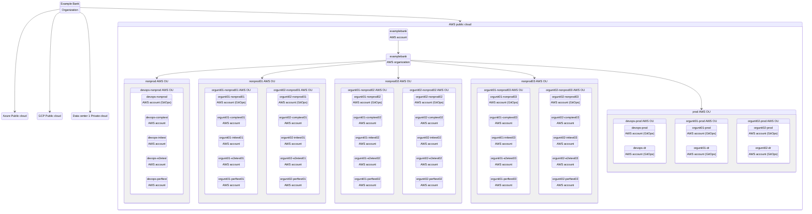

```mermaid
stateDiagram-v2
    classDef badBadEvent fill : #f00,color:white,font-weight:bold,stroke-width:2px,stroke:yellow
    example_bank_organization : Example Bank 
    example_bank_organization : Organization
    aws_public_cloud : AWS public cloud
    example_bank_organization --> aws_public_cloud
    state aws_public_cloud {
        examplebank_aws_account : examplebank
        examplebank_aws_account : AWS account
        examplebank_aws_organization : examplebank
        examplebank_aws_organization : AWS organization
        examplebank_aws_account --> examplebank_aws_organization
        nonprod_aws_ou : nonprod AWS OU
        examplebank_aws_organization --> nonprod_aws_ou
        state nonprod_aws_ou {
            devops_nonprod_aws_ou : devops-nonprod AWS OU
            state devops_nonprod_aws_ou {
                direction LR
                devops_nonprod_aws_account : devops-nonprod
                devops_nonprod_aws_account : AWS account (GitOps)
                devops_comptest_aws_account : devops-comptest
                devops_comptest_aws_account : AWS account
                devops_inttest_aws_account : devops-inttest
                devops_inttest_aws_account : AWS account
                devops_e2etest_aws_account : devops-e2etest
                devops_e2etest_aws_account : AWS account
                devops_perftest_aws_account : devops-perftest
                devops_perftest_aws_account : AWS account
            }
        }
        nonprod01_aws_ou : nonprod01 AWS OU
        examplebank_aws_organization --> nonprod01_aws_ou
        state nonprod01_aws_ou {
            orgunit01_nonprod01_aws_ou : orgunit01-nonprod01 AWS OU
            state orgunit01_nonprod01_aws_ou {
                direction LR
                orgunit01_nonprod01_aws_account : orgunit01-nonprod01
                orgunit01_nonprod01_aws_account : AWS account (GitOps)
                orgunit01_comptest01_aws_account : orgunit01-comptest01
                orgunit01_comptest01_aws_account : AWS account
                orgunit01_inttest01_aws_account : orgunit01-inttest01
                orgunit01_inttest01_aws_account : AWS account
                orgunit01_e2etest01_aws_account : orgunit01-e2etest01
                orgunit01_e2etest01_aws_account : AWS account
                orgunit01_perftest01_aws_account : orgunit01-perftest01
                orgunit01_perftest01_aws_account : AWS account
            }
            orgunit02_nonprod01_aws_ou : orgunit02-nonprod01 AWS OU
            state orgunit02_nonprod01_aws_ou {
                direction LR
                orgunit02_nonprod01_aws_account : orgunit02-nonprod01
                orgunit02_nonprod01_aws_account : AWS account (GitOps)
                orgunit02_comptest01_aws_account : orgunit02-comptest01
                orgunit02_comptest01_aws_account : AWS account
                orgunit02_inttest01_aws_account : orgunit02-inttest01
                orgunit02_inttest01_aws_account : AWS account
                orgunit02_e2etest01_aws_account : orgunit02-e2etest01
                orgunit02_e2etest01_aws_account : AWS account
                orgunit02_perftest01_aws_account : orgunit02-perftest01
                orgunit02_perftest01_aws_account : AWS account
            }
        }
        nonprod02_aws_ou : nonprod02 AWS OU
        examplebank_aws_organization --> nonprod02_aws_ou
        state nonprod02_aws_ou {
            orgunit01_nonprod02_aws_ou : orgunit01-nonprod02 AWS OU
            state orgunit01_nonprod02_aws_ou {
                direction LR
                orgunit01_nonprod02_aws_account : orgunit01-nonprod02
                orgunit01_nonprod02_aws_account : AWS account (GitOps)
                orgunit01_comptest02_aws_account : orgunit01-comptest02
                orgunit01_comptest02_aws_account : AWS account
                orgunit01_inttest02_aws_account : orgunit01-inttest02
                orgunit01_inttest02_aws_account : AWS account
                orgunit01_e2etest02_aws_account : orgunit01-e2etest02
                orgunit01_e2etest02_aws_account : AWS account
                orgunit01_perftest02_aws_account : orgunit01-perftest02
                orgunit01_perftest02_aws_account : AWS account
            }
            orgunit02_nonprod02_aws_ou : orgunit02-nonprod02 AWS OU
            state orgunit02_nonprod02_aws_ou {
                direction LR
                orgunit02_nonprod02_aws_account : orgunit02-nonprod02
                orgunit02_nonprod02_aws_account : AWS account (GitOps)
                orgunit02_comptest02_aws_account : orgunit02-comptest02
                orgunit02_comptest02_aws_account : AWS account
                orgunit02_inttest02_aws_account : orgunit02-inttest02
                orgunit02_inttest02_aws_account : AWS account
                orgunit02_e2etest02_aws_account : orgunit02-e2etest02
                orgunit02_e2etest02_aws_account : AWS account
                orgunit02_perftest02_aws_account : orgunit02-perftest02
                orgunit02_perftest02_aws_account : AWS account
            }
        }
        nonprod03_aws_ou : nonprod03 AWS OU
        examplebank_aws_organization --> nonprod03_aws_ou
        state nonprod03_aws_ou {
            orgunit01_nonprod03_aws_ou : orgunit01-nonprod03 AWS OU
            state orgunit01_nonprod03_aws_ou {
                direction LR
                orgunit01_nonprod03_aws_account : orgunit01-nonprod03
                orgunit01_nonprod03_aws_account : AWS account (GitOps)
                orgunit01_comptest03_aws_account : orgunit01-comptest03
                orgunit01_comptest03_aws_account : AWS account
                orgunit01_inttest03_aws_account : orgunit01-inttest03
                orgunit01_inttest03_aws_account : AWS account
                orgunit01_e2etest03_aws_account : orgunit01-e2etest03
                orgunit01_e2etest03_aws_account : AWS account
                orgunit01_perftest03_aws_account : orgunit01-perftest03
                orgunit01_perftest03_aws_account : AWS account
            }
            orgunit02_nonprod03_aws_ou : orgunit02-nonprod03 AWS OU
            state orgunit02_nonprod03_aws_ou {
                direction LR
                orgunit02_nonprod03_aws_account : orgunit02-nonprod03
                orgunit02_nonprod03_aws_account : AWS account (GitOps)
                orgunit02_comptest03_aws_account : orgunit02-comptest03
                orgunit02_comptest03_aws_account : AWS account
                orgunit02_inttest03_aws_account : orgunit02-inttest03
                orgunit02_inttest03_aws_account : AWS account
                orgunit02_e2etest03_aws_account : orgunit02-e2etest03
                orgunit02_e2etest03_aws_account : AWS account
                orgunit02_perftest03_aws_account : orgunit02-perftest03
                orgunit02_perftest03_aws_account : AWS account
            }
        }
        prod_aws_ou : prod AWS OU
        examplebank_aws_organization --> prod_aws_ou
        state prod_aws_ou {
            devops_prod_aws_ou : devops-prod AWS OU
            state devops_prod_aws_ou {
                direction LR
                devops_prod_aws_account : devops-prod
                devops_prod_aws_account : AWS account (GitOps)
                devops_dr_aws_account : devops-dr
                devops_dr_aws_account : AWS account (GitOps)  
            }
            orgunit01_prod_aws_ou : orgunit01-prod AWS OU
            state orgunit01_prod_aws_ou {
                direction LR
                orgunit01_prod_aws_account : orgunit01-prod
                orgunit01_prod_aws_account : AWS account (GitOps)
                orgunit01_dr_aws_account : orgunit01-dr
                orgunit01_dr_aws_account : AWS account (GitOps) 
            }
            orgunit02_prod_aws_ou : orgunit02-prod AWS OU
            state orgunit02_prod_aws_ou {
                direction LR
                orgunit02_prod_aws_account : orgunit02-prod
                orgunit02_prod_aws_account : AWS account (GitOps)
                orgunit02_dr_aws_account : orgunit02-dr
                orgunit02_dr_aws_account : AWS account (GitOps) 
            }
        }
    }
    azure_public_cloud : Azure Public cloud
    example_bank_organization --> azure_public_cloud
    gcp_public_cloud : GCP Public cloud
    example_bank_organization --> gcp_public_cloud
    data_center_1_private_cloud : Data center 1 Private cloud
    example_bank_organization --> data_center_1_private_cloud
```
